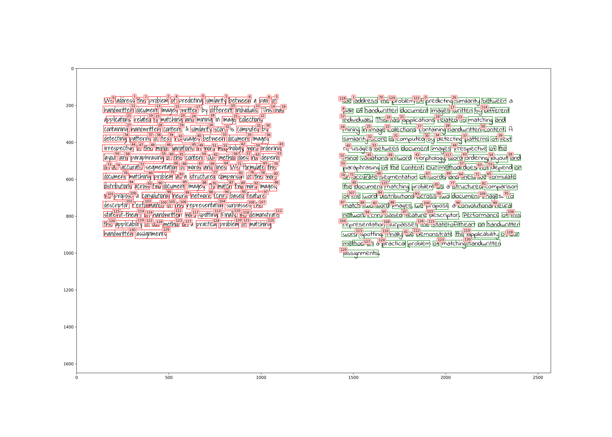

# matching-handwritten-document-images
Attempt at reconfiguring in python of [Matching Handwritten Document Images](https://arxiv.org/abs/1605.05923), Praveen Krishnan, C.V. Jawahar

## ToDo

- [x] TextBoxes: EAST.
- [x] Feature-Extraction on the Fly: Adapt HWNet Inference.
- [x] Hungarian Matching: [munkres](https://github.com/bmc/munkres).
- [x] Visualization
- [ ] Scaling to many images.

## Sample Output

